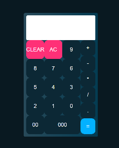

<h1 align="center"> Aplicação Web de notícias </h1>

## 🐱‍👤 Sobre

Primeiro projetinho para aprender **ReactJS** e desenvolver boas praticas no desenvolvimento web.

---
<h4 align="center"> 
	🚧   Em construção...  🚧
</h4>

---

## 👾Tecnologias Utilizadas

- ReactJS

## 🐱‍🐉Como baixar o projeto

### Pré-requisitos

Antes de começar, você vai precisar ter instalado em sua máquina as seguintes ferramentas:

- [Git](https://git-scm.com)
- [Yarn](https://yarnpkg.com/getting-started/install)
- [Node](https://nodejs.org/en/download/)

Além disto é bom ter um editor para trabalhar com o código como [VSCode](https://code.visualstudio.com/)

### 🎲 Passos para executar o projeto em sua máquina

1. Baixe e instale o Git/Node em sua máquina.
2. Clone ou baixe o repositório

```bash
# Clone este repositório
$ git clone <https://github.com/kmyl159/ReactCalculator.git>
```

3. Na pasta do projeto inicie o servidor através do seguinte código no promt ou terminal.

```bash
# Inicie com Npx
$ npm start

```

4. Abra seu navegador favorito na porta padrão do projeto
5. Viva! É isso aí!

## 🤳Telas da aplicação



---
Desenvolvido por Camilo Lopes.